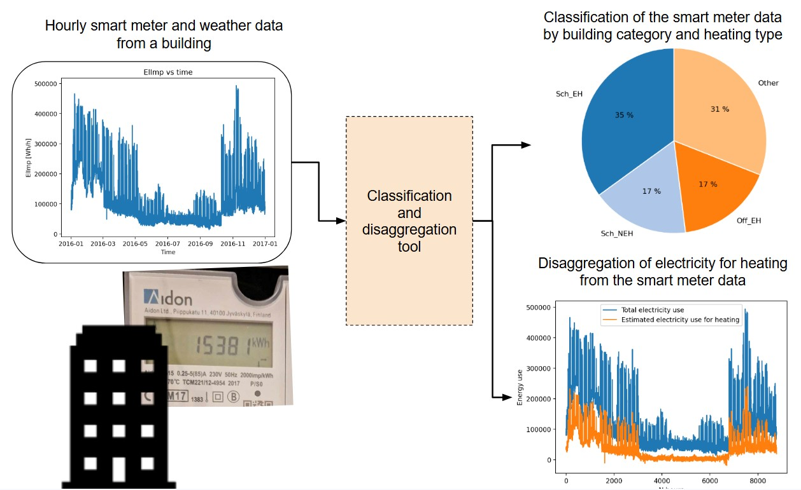

# COF-Tool: A tool for building classification and disaggregation of heating energy from hourly electricity load profiles from buildings

COF-Tool is a Python tool for classification of building characteristics and disaggregation of electricity use for heating based on hourly electricity smart meter data. The models are trained on real-life data from Norwegian buildings and are intended for use on Norwegian building data.

For users who do not wish to run the code locally, a user-friendly web interface is available:

🔗 [https://cof-tool.streamlit.app/](https://cof-tool.streamlit.app/)

---

## About the tool

COF-Tool consists of two supervised machine-learning modules that can be used independently or as a combined workflow:

- **CofClassification**
  Classifies building category (e.g. school, apartment or office) and heating type (electric or non-electric) from hourly building energy use data.
  The results are reported as class probabilities or most probable class.

- **CofDisaggregation**
  Estimates electricity used for heating from hourly building energy use data.

Both modules use hourly time series data representing individual Norwegian buildings containing timestamps, imported electricity, and outdoor temperature.

---

## Quickstart

To get an overview of the app, the input file and the outputs, have a look at the streamlit app. 🔗 [https://cof-tool.streamlit.app/](https://cof-tool.streamlit.app/)
To get started with the tool locally, download the modules, install the dependencies (requirements.txt) and run the example script examples/example.py
The example script in `examples/` demonstrates how to load a building file, run classification, and run disaggregation using the trained models.

---

## Repository structure

The repository is organized into the following main components:

* `modules/`
  Core Python modules for classification and disaggregation of building energy files.

  * `CofClassification/`
    Classification code and trained models.
    Trained classification models are stored in `modules/CofClassification/resources/`.
  * `CofDisaggregation/`
    Disaggregation code and trained models.
    Trained disaggregation models are stored in `modules/CofDisaggregation/resources/`.

* `examples/`
  Example input files and scripts showing how to apply the trained models and how to train and evaluate the classification and disaggregation models. The example files are from the COFACTOR-SBHUB Oslo dataset and COFACTOR Drammen dataset, see reference below. 

* `app/`
  Source code for the Streamlit web interface.

* `requirements.txt`
  Python package dependencies required to run the modules and the Streamlit application.

---

## Data and data requirements

The tool expects input files in the treASURE format. Each file must include:

* a building information section with metadata
* an hourly time series section

Example files are available in `examples/example_files` and are used by the example scripts in the repository.

The time series section must contain at least the following columns:

* TimeStamp
* electricity load (ElImp, ElTot, or X)
* outdoor temperature (Tout)

Additional variables may be included but are not required.

The trained models are based on energy use data from thousands of buildings and building units. Several of the datasets used are not publicly available.

The example files and other datasets are open and may be used for exploration, further development, and to learn more about the treASURE format and energy use measurement considerations. Related open-source datasets include:

* COFACTOR Drammen dataset: Four years of hourly energy use data from 45 public buildings in Drammen, Norway
  https://www.nature.com/articles/s41597-025-04708-3

* COFACTOR-SBHUB Oslo: Hourly sub-metered energy use data from 48 public school buildings in Oslo, Norway
  https://www.sciencedirect.com/science/article/pii/S2352340925010091

* COFACTOR-residential: Hourly electricity and heating data from residential buildings in Norway
  https://www.sciencedirect.com/science/article/pii/S2352340926001332

---

## Scientific background and reference

The tool and modelling framework are described in the following research article:

ARTICLE REFERENCE

If you use this tool or any results produced by it, you must cite the article above.

---

## Scope and limitations

The models included in the tool are trained on real-life data from Norwegian buildings and are intended only for use on Norwegian building data.

The disaggregation module is developed for larger buildings with electric heating, such as apartment blocks and non-residential buildings. It has not been trained or validated for smaller residential units such as single-family houses or individual apartments.

The tool is not intended as a production system or a real-time application.

---

## License and acknowledgement

The tool and its outputs are released under the MIT License.  Any use of the tool or results produced by it must give appropriate credit.

This tool was developed as part of the PhD project of Synne Krekling Lien and the research project *Coincidence factors and peak loads of buildings in the Norwegian low carbon society*(COFACTOR) and released in 2026.

The authors gratefully acknowledge support from the Research Council of Norway (project number 326891), as well as contributions from research partners, industry partners, and data providers.

---

## Author and contact

Synne Krekling Lien

Email: [synnekreklinglien@gmail.com](mailto:synnekreklinglien@gmail.com)

Last updated: 12.03.2026